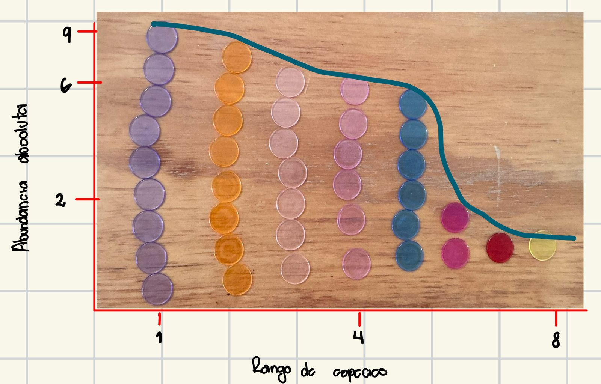
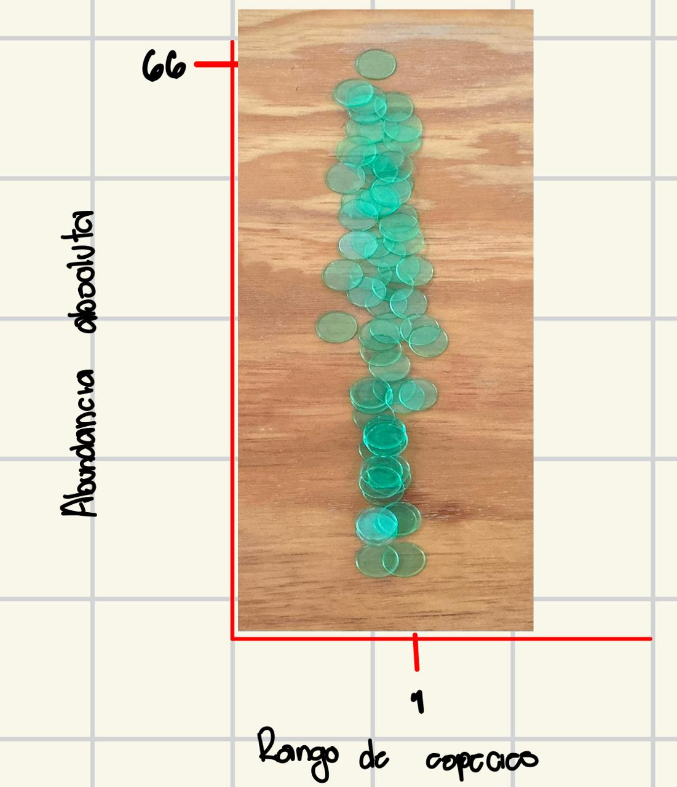

# Introducción 
En esta práctica exploraremos la diversidad de especies simulada en diferentes sitios, representados por bolsas con fichas de colores que simulan diferentes especies. Cada color representa una especie distinta, y la frecuencia de cada ficha es indicativa de la abundancia de esa especie en el sitio.

La diversidad de especies es un aspecto fundamental en los estudios ecológicos, y su análisis permite evaluar la estructura y composición de comunidades biológicas. La diversidad alfa mide la variabilidad dentro de un solo sitio y se cuantifica mediante diferentes índices. La entropía de Shannon es una de las métricas más utilizadas para medir la diversidad alfa, combinando riqueza y equitatividad de especies (Gauthier & Derôme, 2020, 2021). Sin embargo, un solo valor de Shannon puede representar múltiples combinaciones de riqueza y equitatividad, lo que podría ocultar diferencias ecológicas importantes.

Los índices de diversidad buscan capturar tanto la riqueza como la equitatividad de especies en las comunidades biológicas. El método de Pielou, que representa las abundancias relativas de las tres especies más comunes, ha sido mejorado para acomodar datos de series temporales y relaciones en n dimensiones (Clark, 1992). El índice de Simpson es ampliamente utilizado, aunque tiene limitaciones (Sagar & Sharma, 2012). La diversidad de Simpson, junto con la riqueza de especies y la información de Shannon, son las medidas no paramétricas más empleadas, cada una con sesgos de muestreo y varianza distintos (Lande, 1996). A diferencia de otros índices, el de Simpson posee un estimador no sesgado y puede descomponerse en componentes de diversidad alfa y beta (Lande, 1996). Tanto el índice de Shannon como el de Gini-Simpson son comúnmente utilizados, aunque presentan limitaciones en su interpretación y comparación (Jost & Oreja, 2012; Jost, 2006). 

La diversidad beta mide los cambios en la composición de especies entre sitios en distintas escalas espaciales y temporales, y es un enfoque clave en la investigación sobre biodiversidad (Chen et al., 2010). Se han desarrollado múltiples índices para cuantificar la diversidad beta, entre los cuales los de Jaccard y Sørensen son los más utilizados (Chen et al., 2010; Cardoso et al., 2015).

Para evaluar la riqueza de especies considerando diferencias en el tamaño de la muestra, se utiliza la rarefacción, una técnica estadística que permite comparar diversidades comunitarias y estimar la riqueza de especies (Gart et al., 1982). Esta técnica genera curvas de rarefacción, que representan la riqueza esperada de especies en función del tamaño de la muestra (Simberloff, 1978). Estas curvas son herramientas clave para analizar la diversidad taxonómica, evaluar la heterogeneidad ambiental y comparar comunidades biológicas (Gart et al., 1982).

En esta práctica, se calcularon los índices de Shannon, Pielou, Simpson, Simpson inverso, Gini y Chao para estimar la diversidad alfa. Además, se generaron curvas de rarefacción y gráficos de abundancia ordenada para cada sitio. Finalmente, se calculó la diversidad beta mediante los índices de Jaccard y Bray-Curtis, con el objetivo de analizar las diferencias en la composición de especies entre los sitios simulados.

## Visualización de datos 

```{r, message=FALSE, warning=FALSE}
# CARGAR DATOS
library(tidyverse)
abundancias <- read_csv("datos_crudos/abundancias.csv")
abundancias
```


## Índices de diversidad alfa
```{r, message=FALSE, warning=FALSE}
# CREAR FUNCIONES
#Indice de Shannon
shannon <- function(abundancias) {
  proba <- abundancias / sum(abundancias)
  proba <- proba[proba > 0]  # Eliminar ceros antes de calcular el logaritmo
  return(-sum(proba * log(proba)))
}


#Indice de Simpson
simpson <- function(abundancias) {
  prob <- abundancias / sum(abundancias)
  #Condicion de que si solo hay una especie, Simpson debe ser 1
  if (length(prob) == 1) {
    return(1)
  }
  return(1 - sum(prob^2))  
}

#Indice de Pielou
pielou <- function(abundancias) {
  proba <- abundancias / sum(abundancias)
  proba <- proba[proba > 0]  # Eliminar valores 0
  return(-sum(proba * log(proba))) 
}
```


```{r message=FALSE, warning=FALSE, include=FALSE}

##Ejercicios de todas las bolsas


# BOLSA 1 --> LUNA
luna <- abundancias[1, 2:12] 
luna

shannon_luna <- shannon(luna)
simpson_luna <- simpson(luna)
pielou_luna <- pielou(luna)

cat("Índice de Shannon:", shannon_luna, "\n")
cat("Índice de Simpson:", simpson_luna, "\n")
cat("Índice de Pielou:", pielou_luna, "\n")

# BOLSA 2 --> CORAZON 
corazon <- abundancias[2, 2:12] 
corazon

shannon_corazon <- shannon(corazon)
simpson_corazon <- simpson(corazon)
pielou_corazon <- pielou(corazon)

cat("Índice de Shannon:", shannon_corazon, "\n")
cat("Índice de Simpson:", simpson_corazon, "\n")
cat("Índice de Pielou:", pielou_corazon, "\n")

# BOLSA 3 --> NARANJAS
naranjas <- abundancias[3, 2:12]  
naranjas

shannon_naranjas <- shannon(naranjas)
simpson_naranjas <- simpson(naranjas)
pielou_naranjas <- pielou(naranjas)

cat("Índice de Shannon:", shannon_naranjas, "\n")
cat("Índice de Simpson:", simpson_naranjas, "\n")
cat("Índice de Pielou:", pielou_naranjas, "\n")

# BOLSA 4 --> VERDES
verdes <- abundancias[4, 2:12] 
verdes

shannon_verdes <- shannon(verdes)
simpson_verdes <- simpson(verdes)
pielou_verdes <- pielou(verdes)

cat("Índice de Shannon para:", shannon_verdes, "\n")
cat("Índice de Simpson:", simpson_verdes, "\n")
cat("Índice de Pielou:", pielou_verdes, "\n")

# BOLSA 5 --> ALFA
alfa <- abundancias[5, 2:12]  
alfa

shannon_alfa <- shannon(alfa)
simpson_alfa <- simpson(alfa)
pielou_alfa <- pielou(alfa)

cat("Índice de Shannon:", shannon_alfa, "\n")
cat("Índice de Simpson", simpson_alfa, "\n")
cat("Índice de Pielou:", pielou_alfa, "\n")

# BOLSA 6 --> VR
vr <- abundancias[6, 2:12]  
vr

shannon_vr <- shannon(vr)
simpson_vr <- simpson(vr)
pielou_vr <- pielou(vr)

cat("Índice de Shannon:", shannon_vr, "\n")
cat("Índice de Simpson", simpson_vr, "\n")
cat("Índice de Pielou:", pielou_vr, "\n")

# BOLSA 7 --> HAPPY_FACE
happy_face <- abundancias[7, 2:12]  
happy_face

shannon_happy_face <- shannon(happy_face)
simpson_happy_face <- simpson(happy_face)
pielou_happy_face <- pielou(happy_face)

cat("Índice de Shannon:", shannon_happy_face, "\n")
cat("Índice de Simpson", simpson_happy_face, "\n")
cat("Índice de Pielou:", pielou_happy_face, "\n")
```

```{r}
# Crear un data frame con los resultados
resultados <- data.frame(
  Bolsa = c("Luna", "Corazon", "Naranjas", "Verdes", "Alfa", "VR", "Happy_Face"),
  Shannon = c(shannon_luna, shannon_corazon, shannon_naranjas, shannon_verdes, shannon_alfa, shannon_vr, shannon_happy_face),
  Simpson = c(simpson_luna, simpson_corazon, simpson_naranjas, simpson_verdes, simpson_alfa, simpson_vr, simpson_happy_face),
  Pielou = c(pielou_luna, pielou_corazon, pielou_naranjas, pielou_verdes, pielou_alfa, pielou_vr, pielou_happy_face)
)

print(resultados)
```


## Índices de diversidad beta

## Curvas de Rarefacción


## Gráficas de Abundancia 

Las distribuciones de rango abundancia (DRA) son una herramienta poderosa para analizar los patrones de biodiversidad en las comunidades ecológicas. Las DRA representan la abundancia relativa de las especies, proporcionando información sobre la abundancia, la riqueza y la equidad (Foster & Dunstan, 2010). Estas distribuciones pueden modelarse estadísticamente para examinar cómo cambia la biodiversidad a través de gradientes ambientales (Foster & Dunstan, 2010; Dunstan et al., 2012). Las DRA se han utilizado para identificar puntos calientes de biodiversidad y áreas con un alto número de especies raras (Dunstan et al., 2012).

### Gráfica de abundancias de la Bolsa Luna 


### Gráfica de abundancias de la Bolsa Corazón



### Gráfica de abundancias de Bolsa Naranja
![Las curvas de abundancia de las bolsas que contienen solo naranjas o verdes aparecen como una línea en lugar de una curva porque solo tienen una única categoría con abundancia distinta de cero. En estos casos, no hay una distribución de abundancias entre múltiples especies, sino que toda la abundancia está concentrada en una sola. Esto genera una línea plana en el "gráfico" o sea en la foto en lugar de una curva descendente, ya que no hay diferencias de equitatividad o dominancia dentro de la bolsa, solo una presencia exclusiva de una especie.](graficas_abundancias/grafica_naranja.jpeg)

### Gráfica de abundancias de Bolsa Verde



### Gráfica de abundancias de la Bolsa Alfa


### Gráfica de abundancias de la Bolsa VR


### Gráfica de abundancias de la Bolsa Happy Face


### Discusión 


### Preguntas
1. ¿Cómo varían los valores de los índices entre los sitios? ¿Qué diferencias resaltan? 
Los valores entre los índices reflejan una diferencia significativa entre las bolsas (sitios). El **índice de Shannon** muestra que las bolsas como Luna, Happy_Face, Alfa, Corazón y VR tienen una alta diversidad, con valores cercanos a 2.3, lo que indica una distribución equilibrada de especies. En contraste, Naranjas y Verdes presentan un valor de 0, lo que sugiere la presencia de solo una especie dominante en esos sitios. El **índice de Simpson**, que mide la probabilidad de que dos individuos seleccionados al azar pertenezcan a la misma especie, sigue un patrón similar, con valores cercanos a 0.9 en las bolsas diversas, como Luna y VR, y 0 en las bolsas con baja diversidad.Finalmente, el **índice de Pielou**, que evalúa la equidad de la distribución de especies, muestra valores altos en las bolsas diversas (cerca de 2.3), mientras que las bolsas con baja diversidad, como Naranjas y Verdes, tienen un índice de 0, reflejando una distribución desigual en estas áreas.

2. ¿Cuál índice es más sensible a especies raras?
3. ¿Por qué el índice de Pielou nos da información sobre la equitatividad de la comunidad?
El índice de Pielou compara la diversidad que realmente hay en la comunidad con la diversidad "perfecta" que habría si todas las especies tuvieran la misma cantidad de invidviduos. Esto dice que tan "justamente" están repartidos los individuos entre las especies de una comunidad. Un valor de 1 significa que la repartición es equitativa y un valor bajo de 0 significa que algunas especies dominan sobre las demás.

4. ¿Cuál sitio parece tener mayor diversidad según la curva de rarefacción? ¿Por qué?
5. ¿Cómo afecta el tamaño de la muestra en la forma de la curva?
6. ¿Cuál de estos índices es más sensible a la diferencia en abundancias?
7. ¿Qué interpretación ecológica tienen las diferencias entre sitios?
8. ¿Cómo interpretas la forma de las curvas de abundancia?
Las curvas de abundancia muestran una alta variabilidad entre los diversos sitios (bolsas), reflejando diferencias en la equitatividad y dominancia de las categorías. Algunas bolsas presentan distribuciones más uniformes, mientras que otras tienen una categoría dominante con valores cercanos a cero en las demás. Esto indica que la composición varía significativamente entre muestras, afectando la interpretación de la diversidad y posible estabilidad del sistema analizado.

9. ¿Qué implicaciones tienen para la dominancia de especies?
10. ¿Qué patrones generales observaste en la diversidad entre los sitios?
11. ¿Cuál índice te pareció más útil y por qué?
12. ¿Cómo podrías aplicar este análisis en estudios ecológicos reales?


### Bibliografía 
- Foster, S. D., & Dunstan, P. K. (2010). The analysis of biodiversity using rank abundance distributions. Biometrics, 66(1), 186-195.
- Dunstan, P. K., Bax, N. J., Foster, S. D., Williams, A., & Althaus, F. (2012). Identifying hotspots for biodiversity management using rank abundance distributions. Diversity and Distributions, 18(1), 22-32.
- Gauthier, J., & Derome, N. (2020). Evenness-richness scatter plots: a graphical, intuitive approach to alpha diversity analysis. bioRxiv, 2020-09.
- Clark, M. J. R. (1992). Enhancement to the Pielou Method for estimating the diversity of aquatic communities. Environmental toxicology and chemistry, 11(11), 1559-1565.
- Sagar, R., & Sharma, G. P. (2012). Measurement of alpha diversity using Simpson index (1/Lamda): the jeopardy. Environmental Skeptics and Critics, 1(1), 23.
- Lande, R. (1996). Statistics and partitioning of species diversity, and similarity among multiple communities. Oikos, 5-13.
- Jost, L., & González-Oreja, J. (2012). Midiendo la diversidad biológica: más allá del índice de Shannon. Acta zoológica lilloana, 3-14.
- Jost, L. (2006). Entropy and diversity. Oikos, 113(2), 363-375.
- Chen, S., Ouyang, Z., Xu, W., & Xiao, Y. (2010). A review of beta diversity studies. Biodiversity Science, 18(4), 323-335.
- Cardoso, P., Rigal, F., & Carvalho, J. C. (2015). BAT–Biodiversity Assessment Tools, an R package for the measurement and estimation of alpha and beta taxon, phylogenetic and functional diversity. Methods in Ecology and Evolution, 6(2), 232-236.
- Gart, J. J., Siegel, A. F., & German, R. Z. (1982). Rarefaction and taxonomic diversity. Biometrics, 235-241.
- Simberloff, D. (1978). Use of rarefaction and related methods in ecology. In Biological data in water pollution assessment: quantitative and statistical analyses. ASTM International.


## Contribuciones del Equipo 
1. Estrella Segobia: Cargó y preparó los datos para el análisis, calculó el análisis para la diversidad alfa. Realizó las curvas de rarefacción 
2. David Flores: Calculó el análisis de diversidad beta e hizo las matrices
3. Daniela Villanueva: Redactó la introducción, contestó preguntas, generó las gráficas de abundancia, hizo las discusiones de las gráficas de abundancia, 
