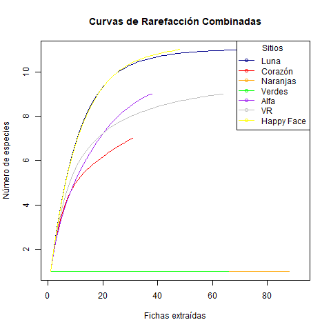

# Introducción

En esta práctica exploraremos la diversidad de especies simulada en diferentes sitios, representados por bolsas con fichas de colores que simulan diferentes especies.
Cada color representa una especie distinta, y la frecuencia de cada ficha es indicativa de la abundancia de esa especie en el sitio.

La diversidad de especies es un aspecto fundamental en los estudios ecológicos, y su análisis permite evaluar la estructura y composición de comunidades biológicas.
La diversidad alfa mide la variabilidad dentro de un solo sitio y se cuantifica mediante diferentes índices.
La entropía de Shannon es una de las métricas más utilizadas para medir la diversidad alfa, combinando riqueza y equitatividad de especies (Gauthier & Derôme, 2020, 2021).
Sin embargo, un solo valor de Shannon puede representar múltiples combinaciones de riqueza y equitatividad, lo que podría ocultar diferencias ecológicas importantes.

Los índices de diversidad buscan capturar tanto la riqueza como la equitatividad de especies en las comunidades biológicas.
El método de Pielou, que representa las abundancias relativas de las tres especies más comunes, ha sido mejorado para acomodar datos de series temporales y relaciones en n dimensiones (Clark, 1992).
El índice de Simpson es ampliamente utilizado, aunque tiene limitaciones (Sagar & Sharma, 2012).
La diversidad de Simpson, junto con la riqueza de especies y la información de Shannon, son las medidas no paramétricas más empleadas, cada una con sesgos de muestreo y varianza distintos (Lande, 1996).
A diferencia de otros índices, el de Simpson posee un estimador no sesgado y puede descomponerse en componentes de diversidad alfa y beta (Lande, 1996).
Tanto el índice de Shannon como el de Gini-Simpson son comúnmente utilizados, aunque presentan limitaciones en su interpretación y comparación (Jost & Oreja, 2012; Jost, 2006).

La diversidad beta mide los cambios en la composición de especies entre sitios en distintas escalas espaciales y temporales, y es un enfoque clave en la investigación sobre biodiversidad (Chen et al., 2010).
Se han desarrollado múltiples índices para cuantificar la diversidad beta, entre los cuales los de Jaccard y Sørensen son los más utilizados (Chen et al., 2010; Cardoso et al., 2015).

Para evaluar la riqueza de especies considerando diferencias en el tamaño de la muestra, se utiliza la rarefacción, una técnica estadística que permite comparar diversidades comunitarias y estimar la riqueza de especies (Gart et al., 1982).
Esta técnica genera curvas de rarefacción, que representan la riqueza esperada de especies en función del tamaño de la muestra (Simberloff, 1978).
Estas curvas son herramientas clave para analizar la diversidad taxonómica, evaluar la heterogeneidad ambiental y comparar comunidades biológicas (Gart et al., 1982).

En esta práctica, se calcularon los índices de Shannon, Pielou, Simpson, Simpson inverso, Gini y Chao1 para estimar la diversidad alfa.
Además, se generaron curvas de rarefacción y gráficos de abundancia ordenada para cada sitio.
Finalmente, se calculó la diversidad beta mediante los índices de Jaccard y Bray-Curtis, con el objetivo de analizar las diferencias en la composición de especies entre los sitios simulados.

## Visualización de datos

```{r, message=FALSE, warning=FALSE}
# CARGAR DATOS
library(tidyverse)
abundancias <- read_csv("datos_crudos/abundancias.csv")
abundancias
```

## Índices de diversidad alfa

Para los índices alfa se utilizó la paquetería vegan para poder confirmar si nuestras funciones estaban bien...

```{r, warning=FALSE, message=FALSE}
library(vegan)
```

```{r message=FALSE, warning=FALSE, include=FALSE}
# Calcular índices con la librería vegan
# BOLSA 1 --> LUNA
luna_vg <- abundancias[1, 2:12]
shannon_luna<-diversity(luna_vg,index="shannon")
pielou_luna<-shannon_luna/log(length(luna_vg))
simpson_luna<-diversity(luna_vg,index="simpson")
simpson_inv_luna<-diversity(luna_vg,index="invsimpson")
chao1_luna<-estimateR(luna_vg)["Chao1"]

# BOLSA 2 --> CORAZON
corazon_vg <- abundancias[2, 2:12] 
shannon_corazon <- diversity(corazon_vg, index = "shannon")
pielou_corazon <- shannon_corazon / log(length(corazon_vg))
simpson_corazon <- diversity(corazon_vg, index = "simpson")
simpson_inv_corazon <- diversity(corazon_vg, index = "invsimpson")
chao1_corazon <- estimateR(corazon_vg)["Chao1"]

# BOLSA 3 --> NARANJAS
naranjas_vg <- abundancias[3, 2:12]
shannon_naranjas <- diversity(naranjas_vg, index = "shannon")
pielou_naranjas <- shannon_naranjas / log(length(naranjas_vg))
simpson_naranjas <- diversity(naranjas_vg, index = "simpson")
simpson_inv_naranjas <- diversity(naranjas_vg, index = "invsimpson")
chao1_naranjas <- estimateR(naranjas_vg)["Chao1"]

# BOLSA 4 --> VERDES
verdes_vg <- abundancias[4, 2:12]
shannon_verdes <- diversity(verdes_vg, index = "shannon")
pielou_verdes <- shannon_verdes / log(length(verdes_vg))
simpson_verdes <- diversity(verdes_vg, index = "simpson")
simpson_inv_verdes <- diversity(verdes_vg, index = "invsimpson")
chao1_verdes <- estimateR(verdes_vg)["Chao1"]

# BOLSA 5 --> ALFA
alfa_vg <- abundancias[5, 2:12]
shannon_alfa <- diversity(alfa_vg, index = "shannon")
pielou_alfa <- shannon_alfa / log(length(alfa_vg))
simpson_alfa <- diversity(alfa_vg, index = "simpson")
simpson_inv_alfa <- diversity(alfa_vg, index = "invsimpson")
chao1_alfa <- estimateR(alfa_vg)["Chao1"]

# BOLSA 6 --> VR
vr_vg <- abundancias[6, 2:12]
shannon_vr <- diversity(vr_vg, index = "shannon")
pielou_vr <- shannon_vr / log(length(vr_vg))
simpson_vr <- diversity(vr_vg, index = "simpson")
simpson_inv_vr <- diversity(vr_vg, index = "invsimpson")
chao1_vr <- estimateR(vr_vg)["Chao1"]

# BOLSA 7 --> HAPPY_FACE
happy_face_vg <- abundancias[7, 2:12]
shannon_happy_face <- diversity(happy_face_vg, index = "shannon")
pielou_happy_face <- shannon_happy_face / log(length(happy_face_vg))
simpson_happy_face <- diversity(happy_face_vg, index = "simpson")
simpson_inv_happy_face <- diversity(happy_face_vg, index = "invsimpson")
chao1_happy_face <- estimateR(happy_face_vg)["Chao1"]
```

```{r, warning=FALSE, message=FALSE}
# Crear un data frame con los resultados
resultados_vg <- data.frame(
  Bolsa = c("Luna", "Corazon", "Naranjas", "Verdes", "Alfa", "VR", "Happy_Face"),
  Shannon = c(shannon_luna, shannon_corazon, shannon_naranjas, shannon_verdes, shannon_alfa, shannon_vr, shannon_happy_face),
  Pielou = c(pielou_luna, pielou_corazon, pielou_naranjas, pielou_verdes, pielou_alfa, pielou_vr, pielou_happy_face),
  Simpson = c(simpson_luna, simpson_corazon, simpson_naranjas, simpson_verdes, simpson_alfa, simpson_vr, simpson_happy_face),
  Simpson_Inverso = c(simpson_inv_luna, simpson_inv_corazon, simpson_inv_naranjas, simpson_inv_verdes, simpson_inv_alfa, simpson_inv_vr, simpson_inv_happy_face),
  Chao1 = c(chao1_luna, chao1_corazon, chao1_naranjas, chao1_verdes, chao1_alfa, chao1_vr, chao1_happy_face)
)

# Ver el data frame con los resultados
print(resultados_vg)

```

## Curvas de Rarefacción

Las dos curvas de rarefacción presentadas muestran patrones similares en la acumulación del número de especies con respecto al esfuerzo de muestreo, aunque hay algunas diferencias notables en la representación de los datos.
La primera imagen corresponde a un análisis realizado con el paquete vegan, mientras que la segunda fue generada con cálculos propios utilizando ggplot.

#### **Gráfica de rarefacción utilizando la libreria vegan**

Esta gráfica proporciona una representación más continua y posiblemente más precisa debido a su metodología estandarizada, ya que por ser una libreria predeterminada interpola los datos.

##### {width="639"}

#### **Gráfica de rarefacción utilizando ggplot**

Esta gráfica fue generada utilizando nuestros calculos hechos en clase, lo que permite representar la relacion entre el muestreo y la acumulacion de especies.
Sin embargo, al no tener interpolacion de los datos, ni estar estandarizado, podemos observar cambios mas bruscos entre puntos, pero logrando observar el patron esperado.

##### 

--\> Ambas gráficas expresan la relación esperada en un análisis de rarefacción: el número de especies se incrementa con el tamaño de la muestra y tiende a estabilizarse en los sitios con mayor diversidad.
En ambas representaciones, se identifican tendencias similares.
Los sitios *"Luna"* *"VR"* y *"Happy Face"* presentan las curvas más elevadas, lo que indica una mayor riqueza de especies en esas localidades.
En contraste, *"Verdes"* y *"Naranjas"* muestran acumulaciones más bajas, lo que sugiere que la diversidad en esos sitios es considerablemente menor.
Además, en lugares como *"VR"* y *"Happy Face"*, la curva alcanza rápidamente un punto de estabilización, lo que indica que el esfuerzo de muestreo fue suficiente para capturar la mayor parte de la diversidad esperada.

## Índices de diversidad beta

#### Índice de Jaccard

La función se realizó con ayuda de el siguiente recurso de internet ([este de aquí!!](https://www.r-bloggers.com/2021/11/how-to-calculate-jaccard-similarity-in-r/)) y quedó de la siguiente manera, está organizado de manera que tome en cuenta los caracteres igual a 1 de cada uno de los vectores o en este caso columnas sin tomar en cuenta los 0, que alteraban el resultado.

```{r}
jaccard<-function(a,b){
  interseccion=length(which(a==1 & b==1))
  union=length(which(a==1))+length(which(b==1))-interseccion
  return(interseccion/union)
}
```

Se aplicó el índice a cada combinación de zonas o bolsas utilizadas para la práctica, es decir, **bolsa 1/zona 1** ***Vs*** **todas las demás** y así respectivamente con las demás zonas.
El pimer paso fue delimitar las zonas para simplificar la sintaxis de la función, para eso se crearon zonas o sitios de la ***a*** a la ***g***:

```{r}
read.csv("datos_crudos/datosjaccard.csv")->jac
jac$sitio1->a
jac$sitio2->b
jac$sitio3->c
jac$sitio4->d
jac$sitio5->e
jac$sitio6->f
jac$sitio7->g
```

Estos fueron los resultados de todas las zonas

```{r,echo=FALSE}
zonas<-data.frame(
  zona1=c(jaccard(a,a),jaccard(a,b),jaccard(a,c),jaccard(a,d),jaccard(a,e),jaccard(a,f),jaccard(a,g)),
  zona2=c(jaccard(b,a),jaccard(b,b),jaccard(b,c),jaccard(b,d),jaccard(b,e),jaccard(b,f),jaccard(b,g)),
  zona3=c(jaccard(c,a),jaccard(c,b),jaccard(c,c),jaccard(c,d),jaccard(c,e),jaccard(c,f),jaccard(c,g)),
  zona4=c(jaccard(d,a),jaccard(d,b),jaccard(d,c),jaccard(d,d),jaccard(d,e),jaccard(d,f),jaccard(d,g)),
  zona5=c(jaccard(e,a),jaccard(e,b),jaccard(e,c),jaccard(e,d),jaccard(e,e),jaccard(d,f),jaccard(d,g)),
  zona6=c(jaccard(f,a),jaccard(f,b),jaccard(f,c),jaccard(f,d),jaccard(f,e),jaccard(f,f),jaccard(f,g)),
  zona7=c(jaccard(g,a),jaccard(g,b),jaccard(g,c),jaccard(g,d),jaccard(g,e),jaccard(g,f),jaccard(g,g))
)
library(knitr)
kable(zonas,col.names=c("zona1","zona2","zona3","zona4","zona5","zona6","zona7"))
```

Como se puede observar en la tabla, la diagonal tiene un valor de 1.0, esto es debido a que es la comparación de cada zona consigo misma, es decir, la **zona 1 vs zona 1**, **zona 2 vs zona 2** y así sucesivamente, de igual manera hay otros dos valores con 1 que corresponden a la comparación de la **zona 1 con la zona 7**, este valor es debido a que en estas dos zonas hay presencia de todas las especies registradas en el experimento, de acuerdo al índice de Jaccard, el valor igual a 1 significa que esas zonas son completamente iguales.
Para la discusión de este índice, se tomaron en cuenta los valores debajo de la diagonal para fines prácticos, aquí se observa un ampliio rango de valores, desde 0 hasta 1, los valores con 0.08 corresponden a la comparación con las zonas que solo tenían fichas de un solo color, de manera que al comararlos con las demás zonas, sale un valor bajo, que de acuerdo al índice de Jaccard, significa que estos dos sitios tienen muy poco en común en cuanto a la presencia de especies, fuera de esta comparación, los demás sitios tienen un rango de valores más estrecho, desde 0.1 a 0.8 los valores más bajos (**0.125**, **0.111** y **0.083**) corresponden a las comparaciones hechas con las zonas 3 y 4, que son las que tuvieron fichas de un solo color, mientras que los valores medios y altos corresponden a los demás sitios en donde hubo pocas diferencias en comparación a los resultados anteriormente descritos.

#### Índice de Bray-Curtis

```{r}
braycurtis<-function(a,b){
  mini<-pmin(a,b)
  arri<-sum(mini)*2
  aba<-sum(a)+sum(b)
  return(1-arri/aba)
}
```

Estos son los resultados para el índice de Bray-Curtis para cada una de las zonas

```{r,echo=FALSE}
read.csv("datos_crudos/datosbray.csv")->bray
bray$sitio1->a1
bray$sitio2->b1
bray$sitio3->c1
bray$sitio4->d1
bray$sitio5->e1
bray$sitio6->f1
bray$sitio7->g1
```

```{r,echo=FALSE}

zonas1<-data.frame(
  zona1=c(braycurtis(a1,a1),braycurtis(a1,b1),braycurtis(a1,c1),braycurtis(a1,d1),braycurtis(a1,e1),braycurtis(a1,f1),braycurtis(a1,g1)),
  zona2=c(braycurtis(b1,a1),braycurtis(b1,b1),braycurtis(b1,c1),braycurtis(b1,d1),braycurtis(b1,e1),braycurtis(b1,f1),braycurtis(b1,g1)),
  zona3=c(braycurtis(c1,a1),braycurtis(c1,b1),braycurtis(c1,c1),braycurtis(c1,d1),braycurtis(c1,e1),braycurtis(c1,f1),braycurtis(c1,g1)),
  zona4=c(braycurtis(d1,a1),braycurtis(d1,b1),braycurtis(d1,c1),braycurtis(d1,d1),braycurtis(d1,e1),braycurtis(d1,f1),braycurtis(d1,g1)),
  zona5=c(braycurtis(e1,a1),braycurtis(e1,b1),braycurtis(e1,c1),braycurtis(e1,d1),braycurtis(e1,e1),braycurtis(e1,f1),braycurtis(e1,g1)),
  zona6=c(braycurtis(f1,a1),braycurtis(f1,b1),braycurtis(f1,c1),braycurtis(f1,d1),braycurtis(f1,e1),braycurtis(f1,f1),braycurtis(f1,g1)),
  zona7=c(braycurtis(g1,a1),braycurtis(g1,b1),braycurtis(g1,c1),braycurtis(g1,d1),braycurtis(g1,e1),braycurtis(g1,f1),braycurtis(g1,g1))
)
library(knitr)
kable(zonas1,col.names=c("zona1","zona2","zona3","zona4","zona5","zona6","zona7"))
```

El índice de Jaccard es una medida estadística empleada para calcular la similitud entre dos agrupaciones de datos, es el tamaño de la intersección entre la unión de dichos conjuntos y es utilizado en la ecología para comparar la similitud y diversidad de conjuntos de muestras.
Se usa para comparar biodiversidad de hábitats centrándose en la presencia y ausencia de especies, pero cuenta con algunas limitaciones para tomar en cuenta al momento considerar su aplicación, por ejemplo, al ignorar la abundancia de especies presentes en un área esto tiende a que haya interpretaciones ambiguas en cuanto a al similitud de dichos lugares dado que en el sitio A puede ser que exista dominancia de una especie, mientras que en el sitio B este equilibrado, pero al no tomar en cuenta la abundancia, el resultado con el índice de Jaccard sería que el sitio A y B son similares entre sí, cuando no es así.

El índice de Bray-Curtis es una medida de similitud o disimilitud entre dos grupos de datos, que frecuentemente es usado en ecología para comparar la composición de especies en distintos sitios, sus valores van desde 0 a 1, siendo 0 la diferencia total entre dos lugares y 1 la similitud total entre dos lugares, en contraste con el índice de Jaccard, Bray-Curtis si toma en cuenta las abundancias de las especies, por lo que puede ofrecer resultados más confiables y apegados a la realidad que el índice de Jaccard.

En los resultados de la tabla, se puede ver que la diagonal son valores de 0, esto es porque se están comparando cada zona consigo misma, los valores de 1 corresponden a las comparaciones realizadas con las zonas que solo tenían 1 especie, es decir, tenían poca riqueza de especies, por lo que al compararla con las demás zonas, no va a coincidir con ninguna, esto es comprobable dado que las columnas de las zonas 3 y 4, que son las zonas con solo fichas naranjas y verdes respectivamente tienen valores altos, muy cercanos a 1, mientras que los demás tienen valores más cercanos a la media de los datos.

Dados los resultados, se puede argumentar las siguientes conclusiones:

\-**La zona 1 es más similar a la zona 6 que las demás áreas**

\-**La zona 2 es similar a la zona 1**

\-**La zona 3 es muy diferente a todas las zonas al igual que la zona 4**

\-**La zona 5 es relativamente similar a la zona 6**

\-**La zona 6 es similar a la zona 1**

\-**La zona 7 tiene más caracteres en común con la zona 1 que con las demás**

Los resultados de los índices de Jaccard y Bray-Curtis difieren en que para el índice de Jaccard los sitios más parecidos entre sí son: zona1-zona7, zona1-zona6, zona6-zona7, mientras que para el índice de Bray-Curtis los sitios más parecidos son: zona1-zona6 y ya, los demás sitios son similares, pero no al nivel de la zona1 con la zona6, estos resultados contrastan ya que el índice de Jaccard no toma en cuenta la abundancia de especies, mientras que el índice de Bray-Curtis si lo hace, por lo tanto, la cantidad de especies registradas en las diferentes zonas de la práctica influye directamente en los resultados para dictaminar la similitud entre estas áreas, mientras que para Jaccard solo basta con que estén presentes las especies sin tomar en cuenta la abundancia de estas, por lo que el índice de Bray-Curtis es más sensible que el de Jaccard en nuestra opinión.

## Gráficas de Abundancia

Las distribuciones de rango abundancia (DRA) son una herramienta poderosa para analizar los patrones de biodiversidad en las comunidades ecológicas.
Las DRA representan la abundancia relativa de las especies, proporcionando información sobre la abundancia, la riqueza y la equidad (Foster & Dunstan, 2010).
Estas distribuciones pueden modelarse estadísticamente para examinar cómo cambia la biodiversidad a través de gradientes ambientales (Foster & Dunstan, 2010; Dunstan et al., 2012).
Las DRA se han utilizado para identificar puntos calientes de biodiversidad y áreas con un alto número de especies raras (Dunstan et al., 2012).

#### **Gráfica de abundancias de la Bolsa Luna**


#### **Gráfica de abundancias de la Bolsa Corazón**


#### **Gráfica de abundancias de Bolsa Naranja**

![Las curvas de abundancia de las bolsas que contienen solo naranjas o verdes aparecen como una línea en lugar de una curva porque solo tienen una única categoría con abundancia distinta de cero. En estos casos, no hay una distribución de abundancias entre múltiples especies, sino que toda la abundancia está concentrada en una sola. Esto genera una línea plana en el "gráfico" o sea en la foto en lugar de una curva descendente, ya que no hay diferencias de equitatividad o dominancia dentro de la bolsa, solo una presencia exclusiva de una especie.](graficas_abundancias/grafica_naranja.jpeg)

#### **Gráfica de abundancias de Bolsa Verde**


#### **Gráfica de abundancias de la Bolsa Alfa**


#### **Gráfica de abundancias de la Bolsa VR**


#### **Gráfica de abundancias de la Bolsa Happy Face**


## **Discusión**

En este reporte, utilizamos diversas herramientas para analizar la diversidad y abundancia de especies, combinando paquetes de R con funciones generadas en clase.
Inicialmente, intentamos calcular los índices alfa con nuestra propia función, pero encontramos varios problemas, como la generación de valores NaN en algunos casos.
Para resolverlo, recurrimos a diversas fuentes, incluyendo internet y asistencia con IA, para identificar si el error provenía de nuestro código o de la base de datos.
A pesar de múltiples intentos de ajustar la función y modificar la base de datos, no logramos obtener los resultados esperados.

Debido a estas dificultades, optamos por usar el paquete *vegan*, que nos permitió calcular los índices alfa de manera más eficiente.
Con este paquete, analizamos la diversidad a través de distintos índices, como Shannon, Simpson, Pielou, Chao1, Gini y Simpson inverso.
Cada uno de estos índices se enfoca en distintos aspectos de la diversidad:

\-**Shannon** mide la diversidad considerando tanto riqueza como equitatividad.

\-**Simpson** evalúa la dominancia de unas pocas especies.

\-**Pielou** indica qué tan equitativa es la distribución de especies.

\-**Chao1** estima la riqueza total, incluyendo especies no observadas.

\-**Gini y Simpson inverso** son variaciones que ayudan a entender la distribución de la abundancia.

El uso del paquete *vegan* facilitó estos cálculos y nos permitió interpretar mejor las diferencias entre los índices, ayudándonos a comprender cómo cada uno refleja distintos aspectos de la biodiversidad.

Además, realizamos un análisis de rarefacción para evaluar el esfuerzo de muestreo necesario para representar la diversidad de especies en los diferentes sitios.
Generamos dos versiones de las curvas de rarefacción usando distintos métodos: una con el paquete *vegan* en R y otra con nuestros propios cálculos en *ggplot*.
Aunque en teoría ambas deberían mostrar los mismos patrones, encontramos diferencias en la forma en que los datos se procesan y visualizan.
La versión con *vegan* generó curvas más suaves y continuas debido que al ser una libreria predeterminada, utiliza la interpolación de los datos, lo que permite visualizar de manera clara los puntos en los que la riqueza de especies comienza a estabilizarse.
En cambio, la versión realizada con *ggplot* presentó curvas más bruscas, ya que los datos fueron calculados de manera puntual, sin interpolaciones.
Esto puede hacer que algunas tendencias no sean tan evidentes a simple vista, aunque mantiene una representación fiel de los datos sin ajustes adicionales.
A pesar de estas diferencias, ambas gráficas muestran tendencias similares, destacando que sitios como "*Luna*", "*VR*" y "*Happy Face*" tienen mayor riqueza de especies, mientras que "*Verdes*" y "*Naranjas*" presentan menor diversidad.

Por otro lado, al analizar las gráficas de abundancia, pudimos visualizar de manera clara las diferencias en diversidad entre los sitios.
La representación gráfica nos permitió identificar rangos de abundancia y observar cómo algunas especies dominaban ciertos sitios mientras que otras tenían distribuciones más equitativas.
Estas gráficas fueron clave para entender la estructura de las comunidades y resaltan la importancia de complementar los análisis numéricos con herramientas visuales para obtener una interpretación más completa de los datos.

### Preguntas

**1. ¿Cómo varían los valores de los índices entre los sitios? ¿Qué diferencias resaltan?**

Los valores entre los índices reflejan una diferencia significativa entre las bolsas (sitios).
El *índice de Shannon* muestra que las bolsas como Luna, Happy_Face, Alfa, Corazón y VR tienen una alta diversidad, con valores cercanos a 2.4, lo que indica una distribución equilibrada de especies.
En contraste, Naranjas y Verdes presentan un valor de 0, lo que sugiere la presencia de solo una especie dominante en esos sitios.
El *índice de Simpson*, que mide la probabilidad de que dos individuos seleccionados al azar pertenezcan a la misma especie, sigue un patrón similar, con valores cercanos a 0.9 en las bolsas diversas, como Luna y VR, y 0 en las bolsas con baja diversidad.Finalmente, el *índice de Pielou*, que evalúa la equidad de la distribución de especies, muestra valores altos en las bolsas diversas (cerca de 2.3), mientras que las bolsas con baja diversidad, como Naranjas y Verdes, tienen un índice de 0, reflejando una distribución desigual en estas áreas.

**2. ¿Cuál índice es más sensible a especies raras?**

El *índice de Shannon*, porque toma en cuenta tanto la cantidad de especies como su equitatividad.
Si hay muchas especies raras, su valor será más alto en comparación con otros índices que solo consideran la especie más abundante.

**3. ¿Por qué el índice de Pielou nos da información sobre la equitatividad de la comunidad?**

El índice de Pielou compara la diversidad que realmente hay en la comunidad con la diversidad "perfecta" que habría si todas las especies tuvieran la misma cantidad de invidviduos.
Esto dice que tan "justamente" están repartidos los individuos entre las especies de una comunidad.
Un valor de 1 significa que la repartición es equitativa y un valor bajo de 0 significa que algunas especies dominan sobre las demás.

**4. ¿Cuál sitio parece tener mayor diversidad según la curva de rarefacción? ¿Por qué?**

El sitio con mayor diversidad es *Luna*, porque su curva de rarefacción sube más alto que las demás, lo que indica que tiene un mayor número de especies conforme se extraen más muestras.
En cambio, los sitios con curvas más bajas tienen menos especies.

**5. ¿Cómo afecta el tamaño de la muestra en la forma de la curva?**

El tamaño de la muestra afecta la curva porque al principio, cuando se extraen fichas, se descubren nuevas especies rápidamente, haciendo que la curva suba de manera pronunciada.
Sin embargo, conforme se sigue aumentando la muestra, las especies nuevas aparecen con menos frecuencia y la curva se va estabilizando.
Como en el caso de las "*Naranjas*" y "*Verdes*", la curva se volvería completamente plana cuando ya no haya más especies nuevas por encontrar.

**6. ¿Cuál de estos índices es más sensible a la diferencia en abundancias?**

El *índice de Simpson* es el más sensible a la diferencia en abundancias porque da más importancia a las especies dominantes.
Si en un sitio hay una especie que tiene muchos más individuos que las demás, este indice tendra un valor más bajo.

**7. ¿Qué interpretación ecológica tienen las diferencias entre sitios?**

Las diferencias en los índices pueden indicar distintos factores ecológicos.
Sitios con alta diversidad y equidad pueden tener condiciones ambientales favorables y menos competencia, mientras que los sitios donde una especie domina pueden reflejar estrés ambiental, competencia fuerte o condiciones que solo favorecen a unas pocas especies.

**8. ¿Cómo interpretas la forma de las curvas de abundancia?**

Las curvas de abundancia muestran una alta variabilidad entre los diversos sitios (bolsas), reflejando diferencias en la equitatividad y dominancia de las categorías.
Algunas bolsas presentan distribuciones más uniformes, mientras que otras tienen una categoría dominante con valores cercanos a cero en las demás.
Esto indica que la composición varía significativamente entre muestras, afectando la interpretación de la diversidad y posible estabilidad del sistema analizado.

**9. ¿Qué implicaciones tienen para la dominancia de especies?**

Si en un sitio una especie domina, significa que las demás tienen dificultades para competir.
Esto puede deberse a que la especie dominante tiene ventajas adaptativas, como mejor acceso a recursos o resistencia a condiciones adversas.
También puede indicar alteraciones en el ecosistema que favorecen solo a ciertas especies.

**10. ¿Qué patrones generales observaste en la diversidad entre los sitios?**

Observamos que la diversidad varía significativamente entre los sitios (bolsas), con algunas comunidades dominadas por pocas especies y otras con una distribución más equitativa.
En ciertos sitios, la curva de abundancia mostró una caída abrupta, lo que indica que una o pocas especies son dominantes, mientras que en otros la abundancia estuvo más distribuida.
Además, los índices alfa reflejaron estas diferencias, mostrando valores más altos en sitios con mayor equitatividad y riqueza de especies.

**11. ¿Cuál índice te pareció más útil y por qué?**

En la diversidad beta, el índice más útil fue *Bray-Curtis*, ya que considera la abundancia de especies, proporcionando más información que *Jaccard*, el cual solo mide presencia y ausencia.
Esto nos permitió detectar diferencias más detalladas entre comunidades.

En la diversidad alfa, el índice más útil fue *Shannon*, ya que una de las ventajas que notamos fue que este índice considera tanto la abundancia como la riqueza de especies, y nos proporcionó una medida más completa de la diversidad alfa.
Es más sensible a cambios, tanto en la abundancia relativa como en la riqueza de especies.

**12. ¿Cómo podrías aplicar este análisis en estudios ecológicos reales?**

Creemos que podría aplicarse en el monitoreo de ecosistemas ayudando a detectar cambios en la diversidad debido a impactos ambientales como la contaminación, la fragmentación de hábitats o el cambio climático.Por ejemplo en los cambios de diversidad que pueden ser señales de impactos ambientales.
Por ejemplo, si en un ecosistema la diversidad empieza a disminuir, puede indicar que la contaminación está afectando la supervivencia de ciertas especies.La fragmentación de hábitats también puede reducir la cantidad de especies en un área, ya que muchas dependen de espacios amplios y conectados para sobrevivir.
Al analizar estos cambios con índices de diversidad nos puede permitir entender mejor cómo están respondiendo los ecosistemas y tomar medidas para su conservación.

## **Bibliografía**

-   Foster, S. D., & Dunstan, P. K. (2010). The analysis of biodiversity using rank abundance distributions. Biometrics, 66(1), 186-195.
-   Dunstan, P. K., Bax, N. J., Foster, S. D., Williams, A., & Althaus, F. (2012). Identifying hotspots for biodiversity management using rank abundance distributions. Diversity and Distributions, 18(1), 22-32.
-   Gauthier, J., & Derome, N. (2020). Evenness-richness scatter plots: a graphical, intuitive approach to alpha diversity analysis. bioRxiv, 2020-09.
-   Clark, M. J. R. (1992). Enhancement to the Pielou Method for estimating the diversity of aquatic communities. Environmental toxicology and chemistry, 11(11), 1559-1565.
-   Sagar, R., & Sharma, G. P. (2012). Measurement of alpha diversity using Simpson index (1/Lamda): the jeopardy. Environmental Skeptics and Critics, 1(1), 23.
-   Lande, R. (1996). Statistics and partitioning of species diversity, and similarity among multiple communities. Oikos, 5-13.
-   Jost, L., & González-Oreja, J. (2012). Midiendo la diversidad biológica: más allá del índice de Shannon. Acta zoológica lilloana, 3-14.
-   Jost, L. (2006). Entropy and diversity. Oikos, 113(2), 363-375.
-   Chen, S., Ouyang, Z., Xu, W., & Xiao, Y. (2010). A review of beta diversity studies. Biodiversity Science, 18(4), 323-335.
-   Cardoso, P., Rigal, F., & Carvalho, J. C. (2015). BAT–Biodiversity Assessment Tools, an R package for the measurement and estimation of alpha and beta taxon, phylogenetic and functional diversity. Methods in Ecology and Evolution, 6(2), 232-236.
-   Gart, J. J., Siegel, A. F., & German, R. Z. (1982). Rarefaction and taxonomic diversity. Biometrics, 235-241.
-   Simberloff, D. (1978). Use of rarefaction and related methods in ecology. In Biological data in water pollution assessment: quantitative and statistical analyses. ASTM International.

## **Contribuciones del Equipo**

A nosotros no nos gusta dividirnos los trabajos, entonces este reporte se realizó en colaboración en github, todos movimos de todo pero los puntos que pusimos par alas contribuciones personales fue en lo que más se enfocó cada quien.

***1. Estrella Segobia:*** Cargó y preparó los datos para el análisis, calculó el análisis para la diversidad alfa.
Realizó y discutio las curvas de rarefacción.
Contesto preguntas.

***2. David Flores:*** Calculó el análisis de diversidad beta e hizo las matrices, Redactó discusión de índice beta e índice alfa. 

***3. Daniela Villanueva:*** Formato MarkDown, Redactó la introducción, contestó preguntas, generó las gráficas de abundancia, hizo las discusiones de las gráficas de abundancia. Redactó discusión
